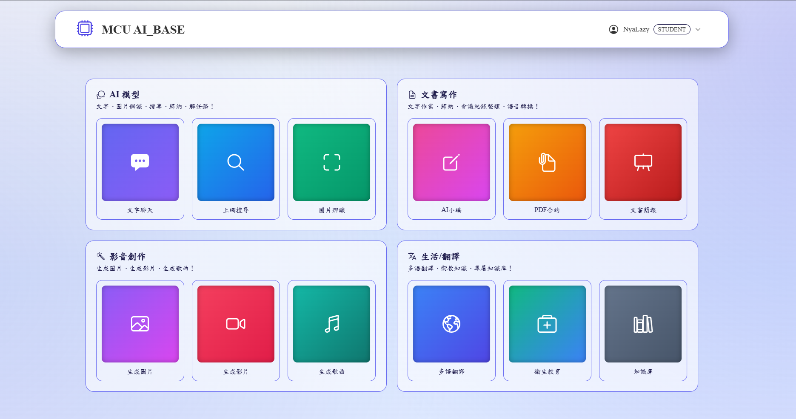

# AI 訓練平台 MVP | AI Training Platform MVP

> **ZH**: 整合了 AI 助手與 GPU 訓練任務排程的一站式平台，提供 LLM 推理與高效能運算管理。  
> **EN**: One-stop platform integrating AI Assistant and GPU training scheduling, offering LLM inference and HPC management.

---

## 📑 目錄 | Table of Contents
- [架構概覽 \| Architecture Overview](#-架構概覽--architecture-overview)
- [介面預覽 \| UI Preview](#-介面預覽--ui-preview)
- [特色功能 \| Features](#-特色功能--features)
- [CodeSpace 專案檔案層級分類](#-codespace-專案檔案層級分類)
- [跨作業系統相容性 (Cross-OS Compatibility)](#-跨作業系統相容性-cross-os-compatibility)
- [各層級部署步驟與工具](#-各層級部署步驟與工具)
- [文檔導覽 \| Documentation Index](#-文檔導覽--documentation-index)
- [模組架構 \| Module Architecture](#-模組架構--module-architecture)
- [測試 \| Testing](#-測試--testing)

---

## 🏗️ 架構概覽 | Architecture Overview

```
工作站 (Browser)                            外部 IdP (v2.1)
    │ HTTP                                  Microsoft Entra ID
    ▼                                       login.microsoftonline.com
Nginx (:80)                                       ▲
    ├── /train/        → web-ui (純 OIDC 入口)    │ OIDC 302
    ├── /code/{user_id}/ → cs-{user_id} (v2.0 code-server)
    ├── /              → Open WebUI (備用)         │
    └── /api/v1/       → job-scheduler (FastAPI :8002)
                               ├── /api/v1/sso/oidc/* (v2.1)
                               ├── /api/v1/lab/* (v2.0 Lab session 管理)
                               ├── /api/v1/secrets/* (v2.0 AES-256-GCM)
                               ├── SQLite     (任務佇列 / 使用者資料 / lab_sessions)
                               ├── Portkey (LLM Gateway :8000)
                               └── lab_manager → docker.sock (動態建 cs-{user})

GPU Worker Agent (Pull 輪詢 ← /api/v1/worker/take)
    └── docker run --gpus all  (隔離訓練容器，含自動注入 secrets + per-user volume)

管理員介面 (Port 8888) ← 獨立於使用者介面，緊急救援用 (SSO 故障也能進)
```

### v2.1 SSO 上線後的登入流程

```
使用者 → 瀏覽器
  ├── 學生 / 老師 → port 80 → 點「使用學校帳號登入」
  │                  → 跳 Microsoft Entra → 認證 → 回 /sso/oidc/callback
  │                  → 簽 JWT → 進 user UI
  │
  └── 管理員 → port 8888 → username + password (本機)
              → /api/v1/auth/login → 簽 JWT → 進 admin UI
```

## 📸 介面預覽 | UI Preview


*全新的 AI Hub 入口導覽大廳，提供直覺的分類服務*

---

## 🌟 特色功能 | Features

### v2.1 SSO 整合（2026-05 新增）
- **Microsoft Entra ID OIDC**：MCU 學生 / 老師用學校 Microsoft 帳號一鍵登入；支援 3 種 provider 切換（Mock / CAS / OIDC）
- **4 種 auth_source 分流**：`local` / `sso_mock` / `sso_cas` / `sso_oidc`，前後端依此分流密碼變更 UI 與權限
- **PENDING fail-safe**：IT 還沒給 `client_id` 時系統自動降級成 mock + warning，服務不會崩
- **Admin 完全分離**：管理員走獨立 port 8888，學生看不到管理頁面入口（v1.2 設計）

### v2.0 Lab 模組（2026-05 新增）
- **code-server (VS Code in Browser)**：每位使用者一個容器、idle 30 分鐘自動關閉、檔案持久保留
- **aibase-runner extension**：右鍵 .py / Notebook cell 「Run on GPU」直接送 GPU 叢集
- **Secrets 管理**：AES-256-GCM 加密，提交 Job 自動注入容器 env（HF_TOKEN / WANDB_API_KEY 等）
- **Storage 生命週期**：active / frozen / archived / pending_delete 四階段、admin audit log

### 核心功能
- **AI Hub 四宮格導覽**：直覺切換「AI模型、文書寫作、影音創作、生活翻譯」
- **i18n 多國語言**：全系統支援中英文即時切換，包含 Aria 無障礙標籤同步
- **高科技 HUD 視覺**：Cyberpunk 風格玻璃擬態 (Glassmorphism) 介面設計
- **SSE 異常處理**：穩健的串流攔截機制，確保 Token 用盡時不會遺失對話進度
- **自動化參數建議 (Auto-Config)**：上傳資料集時，後端自動解析內容並推薦訓練參數
- **SMTP 郵件通知系統**：支援帳號建立、密碼變更與登入狀態的即時 Email 通知

---


## 🏗️ CodeSpace 專案檔案層級分類

整個專案依照部署位置分為三個主要層級：

### 1. 💻 工作站 (Workstation)
開發者本機或管理員操作端，主要用於代碼開發、測試與遠端部署。終端使用者則僅透過此層級的瀏覽器存取系統。
- `docs/`：專案文件與開發指南。
- `scripts/`：部署腳本（如 `deploy.sh`）。
- `tests/`：自動化測試與 E2E 測試腳本。
- `.env.example` / `README.md` / `.gitignore`：開發環境說明與配置範本。

### 2. ☁️ 服務層 (Service Layer)
核心伺服器 (Ubuntu)，負責 API 路由、排程管理、資料持久化與前端靜態資源託管。
- `docker-compose.yml` / `docker-compose.ai-models.yml`：微服務編排檔。
- `infrastructure/`：基礎設施配置（Nginx、SQL Schema）。
- `job-scheduler/`：FastAPI 後端核心服務（認證、排程、CRUD）。
- `web-ui/`：前端介面（HTML/CSS/JS）。
- `portkey/`：LLM 網關配置。
- `data/`：(運行時產生) SQLite 資料庫與持久化資料。
- `.env`：正式環境變數。

### 3. 🚀 GPU高階伺服器 (GPU High-End Server)
負責實際執行 AI 模型訓練與高耗能運算的資源節點 (Windows 11/Ubuntu)。
- `gpu-worker/`：GPU 伺服器專用的 Worker Agent 配置檔，提供一鍵式 Docker Compose 啟動環境。
- (訓練腳本由 GPU Worker 主動向服務層請求後於本地 Docker 容器中運行)

---

## 🌍 跨作業系統相容性 (Cross-OS Compatibility)

得益於全面的 **Docker 容器化 (Containerization)**，本專案**所有層級（服務層、GPU 節點）**皆已消除對特定作業系統環境腳本 (`.bat`, `.sh`, `.ps1`) 的依賴，達成 **Windows、Linux (Ubuntu/CentOS 等) 與 macOS** 的完全相容。

唯一的差異在於「安裝 Docker 引擎」以及「終端機指令格式」：

| 作業系統 | Docker 安裝方式 | 啟動指令差異 | 檔案路徑格式差異 |
|---------|---------------|-------------|----------------|
| **Windows** | 安裝 Docker Desktop (需啟用 WSL2) | `docker-compose up -d --build` (部分舊版使用 `-` 符號) | 使用 `\` 或 `/` 皆可 |
| **Linux (Ubuntu)** | `sudo apt install docker.io docker-compose-v2` | `docker compose up -d --build` (官方 V2 新版指令) | 嚴格區分大小寫，使用 `/` |
| **macOS** | 安裝 Docker Desktop for Mac | `docker compose up -d --build` | 使用 `/` |

*(註：專案內遺留的 `scripts/deploy.sh` 僅為 Linux/macOS 開發者提供的快速組合包，並非部署的必要依賴。)*

---

## 🛠️ 各層級部署步驟與工具

### 💻 工作站 (Workstation)
*   **初次部署**：
    1. 安裝 Git 以及對應您 OS 的 Docker 版本。
    2. 執行 `git clone` 取得專案代碼。
    3. 複製 `.env.example` 為 `.env` 並填寫本機開發參數。
*   **往後部署 / 日常維護**：
    *   **工具**：VS Code, Git, `pytest`。
    *   **步驟**：開發新功能後提交版本控制。

### ☁️ 服務層 (Service Layer)
*   **前置條件**：Docker 24.x+, Docker Compose 2.x+
*   **初次部署**：
    ```bash
    # 1. 複製環境設定
    cp .env.example .env
    
    # 2. 啟動所有服務 (Nginx, API, WebUI 等)
    docker compose -f docker-compose.yml -f docker-compose.ai-models.yml up -d --build
    
    # 3. 確認服務狀態
    docker compose ps
    ```
    **存取服務 URL**：
    - **TRAIN_HUD (主入口)**：`http://localhost/train/`
    - Open WebUI：`http://localhost/`
    - API Docs：`http://localhost:8002/docs`
    - Gateway Health：`http://localhost/health`
*   **往後部署 / 更新**：
    *   **工具**：Docker, `docker-compose`, `git pull`。
    *   **步驟**：取得最新代碼後，執行 `docker-compose up -d --build` 重建並重啟更新的容器。若僅更新前端 `web-ui`，通常無需重啟容器，Nginx 會直接讀取新檔案。

### 🚀 GPU高階伺服器 (GPU High-End Server)
*   **初次部署**：
    1. 準備一台安裝好 Windows 11 的 GPU 伺服器，並安裝好 NVIDIA 驅動、WSL 2 與 Docker Desktop。
    2. 將 `gpu-worker/` 目錄複製到該伺服器。
    3. 設定 `docker-compose.yml` 中的環境變數（主機 API 位址與 Token）。
    4. 執行 `docker-compose up -d` 啟動 Worker Agent 主動向主機領取任務。
*   **往後部署 / 擴展**：
    *   **工具**：Docker Compose。
    *   **步驟**：若需擴充算力新增節點，只需在新機器上複製 `gpu-worker` 資料夾並執行 `docker-compose up -d` 即可，主機端完全無需修改任何設定，即插即用。

---

## 📚 文檔導覽 | Documentation Index

依系統層級分類的文檔目錄，方便快速查閱。

| 子資料夾 / 文件 | 說明 |
|------------------|------|
| [00-系統架構與連線流程說明](docs/00-系統架構與連線流程說明.md) | 系統三層分離架構、Worker Agent Pull 流程與資安說明 |
| **01-部署與運營/** | |
| [01-服務層環境設置指南](docs/01-部署與運營/01-服務層環境設置指南.md) | 啟動流程與存取 URL |
| [02-GPU伺服器部署指南](docs/01-部署與運營/02-GPU伺服器部署指南.md) | GPU 工具安裝、內外網部署與 Worker 啟動教學 |
| [03-正式上線轉換指南](docs/01-部署與運營/03-正式上線轉換指南.md) | Windows 測試 → Ubuntu 上線修改清單 |
| [04-系統管理與維護](docs/01-部署與運營/04-系統管理與維護.md) | 備份、監控與 Token 手動重置 |
| [05-SSO整合設定指南](docs/01-部署與運營/05-SSO整合設定指南.md) | SSO Mock/CAS 模式切換與設定 |
| **02-API與開發/** | |
| [06-專案架構與檔案說明](docs/02-API與開發/06-專案架構與檔案說明.md) | 檔案結構與目錄對應說明 |
| [07-API使用手冊](docs/02-API與開發/07-API使用手冊.md) | API 端點、參數與 SSE 異常說明 |
| [08-開發者指南](docs/02-API與開發/08-開發者指南.md) | 模組擴展方式與 i18n 開發指引 |
| [09-工具組件統整](docs/02-API與開發/09-工具組件統整.md) | Portkey, Slurm, DCGM 等組件細節 |
| **03-使用者指南/** | |
| [10-使用者操作手冊](docs/03-使用者指南/10-使用者操作手冊.md) | 針對終端使用者的介面操作指引 |

> **🗺️ 依角色快速導覽**
> - **首次部署者**：閱讀 `00-系統架構與連線流程說明` → `01-服務層環境設置指南` → `02-GPU伺服器部署指南`
> - **系統管理員**：閱讀 `03-正式上線轉換指南` + `04-系統管理與維護` + `05-SSO整合設定指南`
> - **後端開發者**：閱讀 `06-專案架構與檔案說明` + `07-API使用手冊` + `08-開發者指南`

## 🧩 模組架構 | Module Architecture

| 模組 | 路徑 | 職責 |
|------|------|------|
| **Chat Router** | `.../routers/chat.py` | AI 助手串流代理 |
| **Jobs Router** | `.../routers/jobs.py` | 任務管理與狀態追蹤 |
| **Datasets Router**| `.../routers/datasets.py`| 資料集上傳與參數自動推薦 |
| **System Router** | `.../routers/system.py`| 系統設定檔管理 API |
| **Scheduler** | `.../scheduler.py` | 非同步任務排程核心 |
| **Auth** | `.../auth.py` | JWT 認證與權限控管 |

## 🧪 測試 | Testing

```bash
pip install -r tests/requirements.txt
python tests/end_to_end_test.py
```

## 📄 License
Internal use only.
