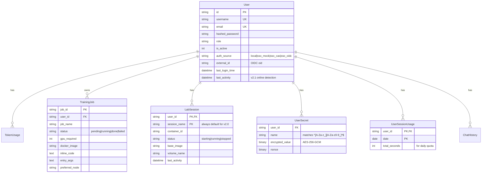

# 02 — 系統架構 | Architecture

三層分離設計：**工作站 → 服務層 → GPU 高階伺服器**。

---

## 1. 整體架構

```
┌─────────────────────────────────────────────────────────────────┐
│  第一層：使用者工作站 (Browser)                                   │
│  瀏覽器 → HTTP/SSE → Nginx                                       │
└─────────────────────────────────────────────────────────────────┘
                              │
                              ▼
┌─────────────────────────────────────────────────────────────────┐
│  第二層：服務層 (Ubuntu / Windows Docker Desktop)                 │
│                                                                  │
│  ┌──────────────┐      ┌──────────────────────────────────────┐ │
│  │ Nginx        │      │ Job Scheduler (FastAPI :8002)        │ │
│  │ :80 (user)   │─────▶│  Routers:                            │ │
│  │ :8888 (admin)│      │    auth / sso / lab / jobs / chat    │ │
│  │              │      │    secrets / datasets / admin /      │ │
│  │ /train/*     │      │    worker (Pull endpoints)           │ │
│  │ /code/<uid>/ │      │  Core:                               │ │
│  │ /api/*       │      │    auth.py (JWT + cookie)            │ │
│  │ → FastAPI    │      │    scheduler.py (背景排程)           │ │
│  └──────────────┘      │    lab_manager (docker SDK 動態起 cs)│ │
│                         └──────────────┬──────────────────────┘ │
│  ┌──────────────┐                      │                        │
│  │ SQLite       │◀─────────────────────┤                        │
│  │ data/*.db    │                      │                        │
│  └──────────────┘                      │                        │
│  ┌──────────────┐                      │                        │
│  │ Portkey      │                      │                        │
│  │ LLM Gateway  │◀─────────────────────┘                        │
│  └──────────────┘                                                │
│  ┌──────────────────────────────────────────────────────┐       │
│  │ cs-<user_id> (v2.0 Lab, 動態啟停)                    │       │
│  │ aibase/code-server image, port 8080                  │       │
│  └──────────────────────────────────────────────────────┘       │
└─────────────────────────────────────────────────────────────────┘
                       ↑ Pull (HTTP, 每 5s)
┌─────────────────────────────────────────────────────────────────┐
│  第三層：GPU 高階伺服器 (Windows 11 + WSL2 / Ubuntu)              │
│                                                                  │
│  gpu-worker container:                                           │
│    1. nvidia-smi 檢查 GPU 空閒                                   │
│    2. POST /api/v1/worker/take → 領取 pending job                │
│    3. docker run --gpus all --rm <image> ...                     │
│       (per-job 隔離容器，自動注入 user secrets + 共享 volume)    │
│    4. POST /api/v1/worker/jobs/<id>/update → 回報 stdout / 進度  │
│    5. 容器結束 → 銷毀 (--rm) → 領下一個                          │
└─────────────────────────────────────────────────────────────────┘
```

**關鍵設計**：
- GPU 節點 **Pull**（主動領取）→ 無需開放對外 port、藏在 NAT 後仍可用
- 服務層**沒有**GPU 節點的 SSH 私鑰 → 服務層被駭頂多塞惡意任務、不能登入 GPU 機
- 訓練容器都是 `--rm` → 結束即清空、惡意腳本最多污染 container 不污染 host

---

## 2. 認證流程

### v2.1 — 三 provider 並存（Mock / CAS / OIDC）

```
                              ┌──────────────────┐
學生 / 老師 → user UI         │ Microsoft        │
   └─→ 「使用學校帳號登入」   │ Entra ID         │
        └─→ /sso/oidc/login ─→│ login.microsoft… │
                              └────────┬─────────┘
                                       │ 302 code+state
                                       ▼
                              /sso/oidc/callback
                                       │
                                       ▼
                       _finalize_sso_login()
                          建/升級 user → 簽 JWT
                                       │
                  ┌────────────────────┼────────────────────┐
                  ▼                    ▼                    ▼
            localStorage          HttpOnly cookie     302 → /train/?sso_token=
            (SPA fetch 用)        (browser navigate    (前端 IIFE 解 URL 存
                                   /code/<uid>/ 用)     localStorage)

admin → port 8888 admin UI
   └─→ username + password (本機 hashed_password)
        └─→ /api/v1/auth/login → 簽 JWT (同上 2 條路同時)
```

**重點**：
- `auth_source` 欄位區分 4 種：`local` / `sso_mock` / `sso_cas` / `sso_oidc`
- 密碼變更 UI 依 `auth_source` 分流（SSO 帳號改密碼導向 IdP）
- admin 走獨立 port 8888，學生不會發現
- Mock SSO **不曝光於 UI 按鈕**（避免 admin 用別人身分）

### Cookie 用途（v2.1 HttpOnly）

| Token 來源 | 用途 | XSS 風險 |
|---|---|---|
| `localStorage['ai_hud_token']` | SPA `fetch()` 帶 `Authorization: Bearer` | 有，但 fetch 必經 IP/CORS 防護 |
| Cookie `ai_hud_token` (HttpOnly) | 瀏覽器 `window.open('/code/<uid>/')` 由 nginx auth_request 讀 | 無（JS 讀不到） |

---

## 3. v2.0 Lab 啟動流程

```
使用者 → user UI → Notebook 分頁 → 點「開啟 Notebook」
   │
   ▼
POST /api/v1/lab/start  {base_image: "aibase/code-server:2026-spring"}
   │
   ▼
lab_manager.start_session(user_id)
   ├─ 檢查每日配額（360 min / day）
   ├─ 找/建 LabSession row (UNIQUE user_id+session_name)
   ├─ 建/重用 per-user volume (home_<user_id>)
   ├─ 注入該 user 的 secrets (env vars)
   └─ docker.containers.run(image, name=cs-<user_id>, network=ai-platform-net)
   │
   ▼
回 200 {url: "/code/<user_id>/?folder=/home/coder/projects", password: ...}
   │
   ▼
前端 window.open(url, '_blank')  → 瀏覽器 navigate
   │
   ▼
nginx /code/<uid>/ location
   │
   ├─ auth_request → /api/v1/lab/_authz (用 HttpOnly cookie 驗 JWT)
   │     └─ 200 OK → 通過
   │     └─ 401 → 退回 nginx 401
   │
   └─ proxy_pass http://cs-<uid>:8080$path  (去掉 /code/<uid> 前綴)
   │
   ▼
code-server (--auth none, nginx 已驗證) → VS Code Web UI
```

**Idle 30 分鐘 + 每日 360 分鐘**：scheduler 背景每 60s 掃描 → 自動關 idle session、累計 daily 用量。

---

## 4. 資料庫 ER 圖（核心表）



---

## 5. 檔案結構（簡）

```
CodeSpace/
├── docker-compose.yml             # nginx + scheduler (核心服務)
├── docker-compose.ai-models.yml   # open-webui + portkey + ollama (LLM 推理層)
├── .env                            # 服務層環境變數
├── README.md
│
├── infrastructure/
│   ├── nginx.conf                  # 反向代理 + auth_request + 動態 cs-<uid> upstream
│   └── base-images/                # Lab base image Dockerfile + build script
│       ├── code-server/            # VS Code in Browser (--auth none)
│       ├── pytorch/                # 訓練 image (PyTorch 2.7 + CUDA 12.8)
│       ├── pytorch-legacy/         # CUDA 11.8 舊環境
│       ├── tensorflow/ huggingface/ llamacpp/ vllm/ dev-tools/
│       └── build-all.sh
│
├── job-scheduler/
│   ├── Dockerfile
│   └── app/
│       ├── main.py                 # FastAPI 入口 (redirect_slashes=False)
│       ├── config.py               # Pydantic Settings + .env 讀取 + OIDC_ENABLED
│       ├── database.py             # SQLAlchemy + WAL + ALTER 自動遷移
│       ├── models.py               # ORM 定義
│       ├── schemas.py              # Pydantic 請求/回應
│       ├── crud.py                 # DB 操作
│       ├── auth.py                 # JWT (Bearer + cookie 雙路)
│       ├── scheduler.py            # 背景排程 (timeout / lab idle / storage)
│       ├── sso_client.py           # Mock / CAS / OIDC client
│       ├── sso_policy.yaml         # provider 切換 + mock users
│       ├── scheduler_policy.yaml   # GPU 節點 + lab 配額參數
│       ├── routers/                # 各 API 群組
│       │   ├── auth.py sso.py admin.py
│       │   ├── jobs.py chat.py datasets.py system.py
│       │   ├── lab.py secrets.py worker.py
│       └── services/
│           ├── lab_manager.py      # docker SDK 起停 code-server
│           ├── secrets_service.py  # AES-256-GCM 加解密
│           ├── quota_service.py    # 每日 360 min / 月 token 配額
│           └── email_service.py    # SMTP 通知
│
├── web-ui/                         # 使用者前端 (vanilla JS + i18n)
│   ├── index.html app.js styles.css
│
├── admin-ui/                       # 管理員前端 (port 8888)
│   ├── index.html admin.js styles.css
│
├── gpu-worker/                     # GPU 節點容器
│   ├── docker-compose.yml          # 換主機只改 SERVICE_LAYER_URL
│   ├── Dockerfile worker.py
│
├── vscode-extension/aibase-runner/ # code-server 內的 Run on GPU extension
│
└── docs/                           # 你正在讀
```

---

## 6. API 路由總覽

| Prefix | 模組 | 認證 |
|---|---|---|
| `/api/v1/auth/*` | 註冊、登入、登出、forgot-password、me、usage | JWT |
| `/api/v1/sso/*` | OIDC login/callback、mock login、providers | 無（callback 後簽 JWT） |
| `/api/v1/jobs/*` | 提交/查/取消 GPU 任務、SSE 進度 | JWT |
| `/api/v1/chat/*` | LLM 對話、聊天歷史、SSE 串流 | JWT |
| `/api/v1/datasets/*` | 資料集上傳、自動分析 | JWT |
| `/api/v1/lab/*` | 啟動/停止 lab session、status、heartbeat、`_authz` | JWT / cookie |
| `/api/v1/secrets/*` | 使用者 AES-256-GCM secrets CRUD | JWT |
| `/api/v1/admin/*` | 使用者管理、配額 grant、storage、audit | JWT (admin) |
| `/api/v1/worker/*` | Pull 任務、更新進度、heartbeat | API_TOKEN（與 .env 對齊） |
| `/api/v1/system/*` | 系統設定、健康檢查 | JWT (admin) |

完整 endpoint 與範例見 [`05-api-reference.md`](05-api-reference.md)。

---

## 7. 安全模型摘要

| 威脅 | 防護 |
|---|---|
| 學生互看別人任務 | JWT 認證 + admin-only 端點 |
| 學生互看別人 Lab 工作目錄 | nginx auth_request 驗 user_id 對應 — ⚠️ v2.1 同網段可繞過，**v2.2 加 per-user network**（見 [`08-status-and-roadmap.md`](08-status-and-roadmap.md)） |
| XSS 偷 token | Cookie `HttpOnly` (v2.1)；不過 localStorage 仍可被 XSS 讀取 |
| Secrets 洩漏 | AES-256-GCM 加密儲存、admin 亦不可讀 plaintext、僅在容器啟動時解密注入 |
| GPU 節點被 SSH 入侵 | 採 Pull 架構、無需開對外 port |
| 服務層被駭 → 橫向移動 | 服務層無 GPU 節點私鑰、最多塞惡意任務（被 `--rm` 容器隔離）|
| 暴力破解 admin | rate limit + emergency-only port 8888 |

---

## 下一步

- [`03-deployment.md`](03-deployment.md) — 加 GPU 工作節點 / SSO / 正式上線
- [`05-api-reference.md`](05-api-reference.md) — API 完整參考
- [`07-development.md`](07-development.md) — 模組擴展、新增 router、i18n
