# 02 — 系統架構 | Architecture

三層分離設計：**工作站 → 服務層 → GPU 高階伺服器**。本文件全面以 **Mermaid** 繪製（GitHub / VS Code「Markdown Preview Mermaid Support」/ Obsidian 皆可直接渲染）。

> **v2.4 更新**：對齊實際部署 — Portkey OSS 監聽 **:8787**（header 路由、Ollama 經 `x-portkey-custom-host`）、新增**動態模型清單**模組（`/api/v1/models` + `Model.tool_types`）、**文書簡報 agent**（`agent_dispatcher` + `document_generator`）、**Lab 就緒偵測**、**GPU per-card telemetry**。新增 §1.5「服務層模組分布與交互」總覽各模組與互動。本機完整部署步驟見 [`00-本機完整部署指南.md`](00-本機完整部署指南.md)。

---

## 1. 整體架構（三層）

> 三層以 L1/L2/L3 subgraph 區隔；拆除前端 SPA / LLM 推理的巢狀內框（巢狀框邊界正是連線橫越主因），群組資訊改寫進節點名稱，並精簡連線標籤避免浮動標籤壓住節點。

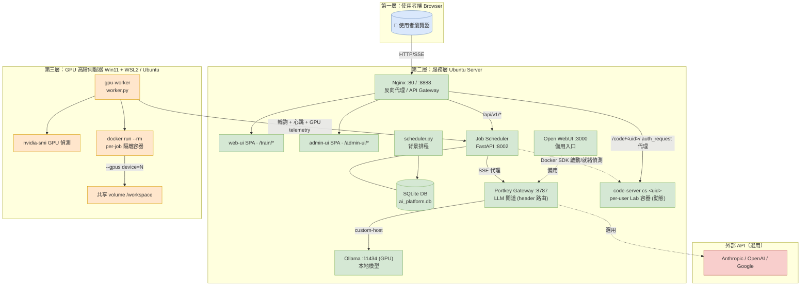

**關鍵設計**：
- GPU 節點 **Pull**（主動領取）→ 無需開放對外 port、藏在 NAT 後仍可用
- 服務層**沒有**GPU 節點的 SSH 私鑰 → 服務層被駭頂多塞惡意任務、不能登入 GPU 機
- 訓練容器都是 `--rm` → 結束即清空、惡意腳本最多污染 container 不污染 host

---

## 1.5 服務層模組分布與交互（Component Map）

> 服務層（Job Scheduler）內部分層「routers（HTTP 端點）→ services（商業邏輯）→ crud（ORM）→ SQLite」，
> 以及與 AI 推理、GPU 節點、per-user Lab 容器的互動。是「各模組分布與交互」的總覽。

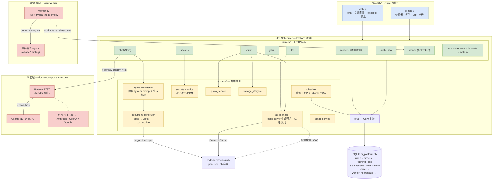

**模組職責對照**：

| 層 | 模組 | 職責 |
|---|---|---|
| routers | `chat` | LLM 對話 SSE 代理；偵測 `tool_type` → 走簡報 dispatch |
| routers | `models` | `GET /api/v1/models?tool_type=` 動態回傳「公開且適用該工具」的模型 |
| routers | `lab` | 啟動/停止 code-server、`_authz`（給 nginx auth_request）|
| routers | `worker` | GPU 節點 pull 任務、回報進度、心跳 + per-GPU telemetry |
| services | `agent_dispatcher` | 依 tool_type 注入專項 system prompt + 生成契約標記（PPTX_SPEC）|
| services | `document_generator` | AI spec → python-pptx 渲染 → `put_archive` 進 Lab 容器 `/home/coder/outputs/` |
| services | `lab_manager` | code-server 容器生命週期、就緒偵測 `_wait_until_ready`（避免開頁 503）|
| services | `storage_lifecycle` | 使用者儲存 freeze/archive/restore、`list_states` |
| services | `scheduler` | 背景任務：訓練超時清理、Lab idle 驅逐、儲存生命週期掃描 |

---

## 2. 認證流程

平台**三 provider 並存**：`local`（本機帳號）/ `sso_mock` / `sso_cas` / `sso_oidc`（Microsoft Entra ID）。下圖以「本機帳號 + SSO Mock + 受保護端點」為代表；OIDC 另在 IdP 端多一段 302 redirect（見下方說明）。

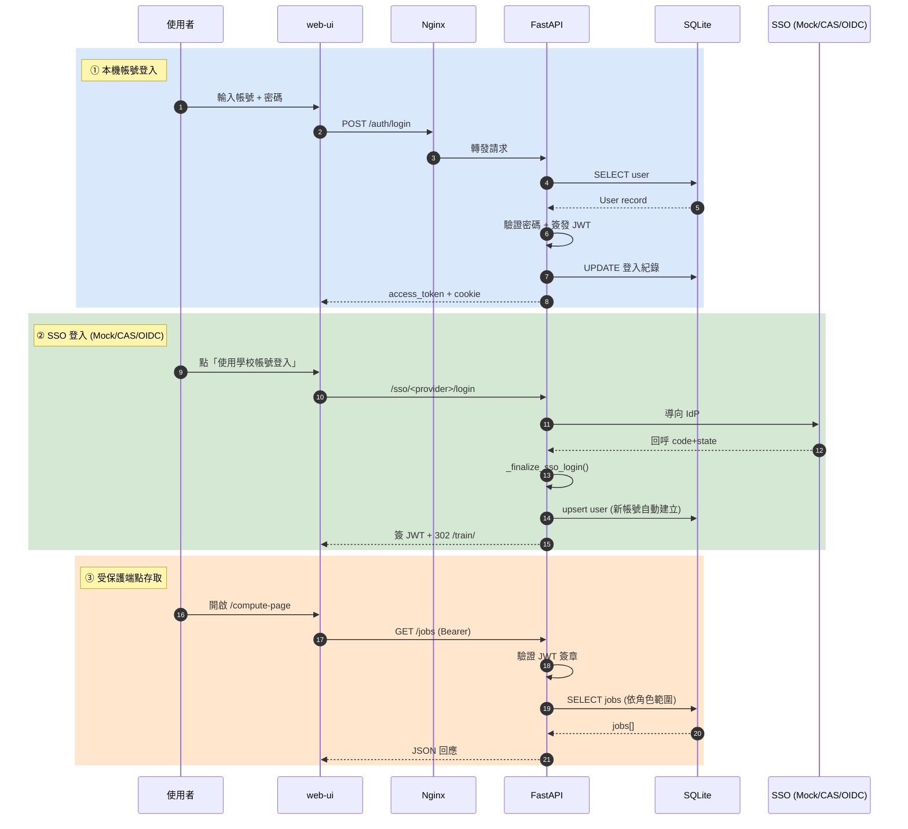

**重點**：
- `auth_source` 欄位區分 4 種：`local` / `sso_mock` / `sso_cas` / `sso_oidc`
- 密碼變更 UI 依 `auth_source` 分流（SSO 帳號改密碼導向 IdP）
- admin 走獨立 port 8888，學生不會發現
- Mock SSO **不曝光於 UI 按鈕**（避免 admin 用別人身分）

### Cookie 用途（v2.1 HttpOnly）

| Token 來源 | 用途 | XSS 風險 |
|---|---|---|
| `localStorage['ai_hud_token']` | SPA `fetch()` 帶 `Authorization: Bearer` | 有，但 fetch 必經 IP/CORS 防護 |
| Cookie `ai_hud_token` (HttpOnly) | 瀏覽器 `window.open('/code/<uid>/')` 由 nginx auth_request 讀 | 無（JS 讀不到） |

---

## 3. v2.0 Lab 啟動流程

```mermaid
sequenceDiagram
    autonumber
    participant U as 使用者
    participant FE as web-ui
    participant API as FastAPI (lab router)
    participant LM as lab_manager
    participant DK as Docker SDK
    participant CS as cs-&lt;uid&gt; (code-server)
    participant NGX as Nginx

    rect rgb(218, 232, 252)
        Note left of U: ① 啟動 Lab
        U->>FE: Notebook 分頁 → 點「開啟 Notebook」
        FE->>API: POST /lab/start {base_image}
        API->>LM: start_session(user_id)
        LM->>LM: 檢查每日配額 (360 min/day)
        LM->>LM: 找/建 LabSession + volume
        LM->>DK: containers.run(name=cs-&lt;uid&gt;)
        DK-->>LM: 容器啟動
        LM-->>API: url + password
        API-->>FE: 200 {url: /code/&lt;uid&gt;/, pwd}
        FE->>U: window.open(url, '_blank')
    end

    rect rgb(213, 232, 212)
        Note left of U: ② 存取 code-server (每次請求)
        U->>NGX: GET /code/&lt;uid&gt;/...
        NGX->>API: auth_request → /lab/_authz
        API-->>NGX: 200 OK 或 401
        NGX->>CS: proxy_pass cs-&lt;uid&gt;:8080
        CS-->>U: VS Code Web UI
    end
```

**Idle 30 分鐘 + 每日 360 分鐘**：scheduler 背景每 60s 掃描 → 自動關 idle session、累計 daily 用量。

---

## 4. 資料庫 ER 圖（核心表）

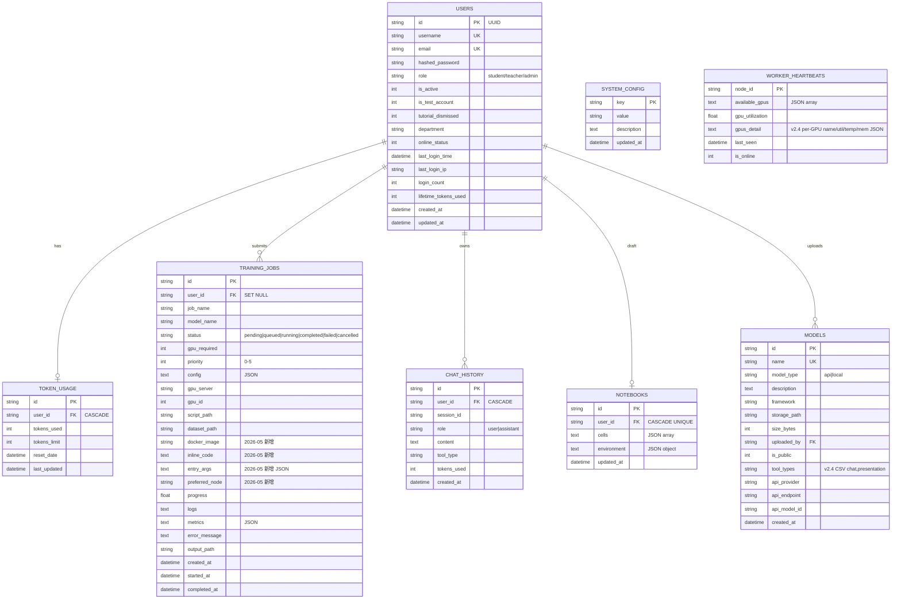

---

## 5. 檔案結構樹

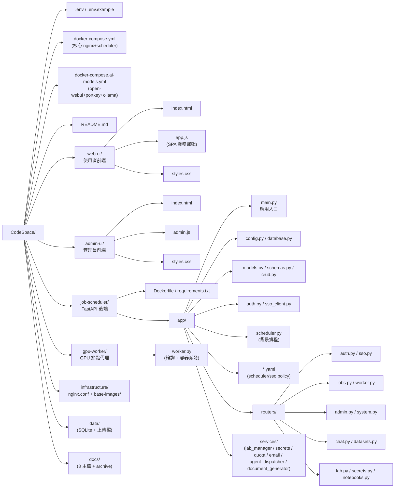

---

## 6. Docker 容器網路

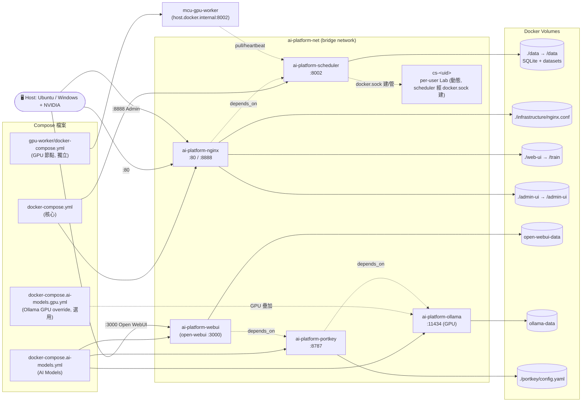

> 注意：`gpu-worker` 為**獨立 compose / 獨立網路**，透過 host 的 `:8002`（同機用 `host.docker.internal`）連服務層；
> 它不在 `ai-platform-net` 內。`cs-<uid>` 由 scheduler 經 `docker.sock` 動態建立並掛 `ai-platform-net`。

---

## 7. API 端點地圖

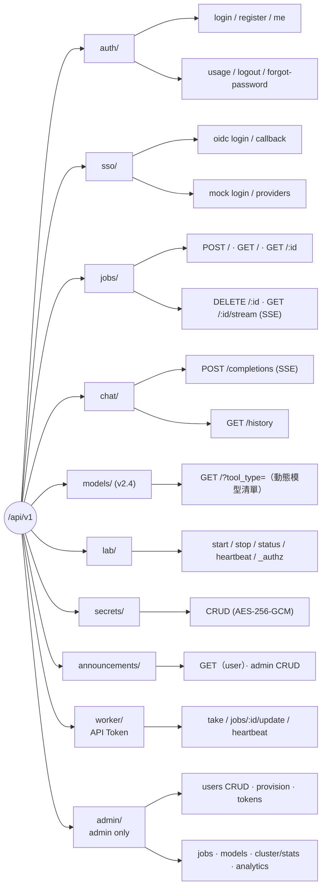

完整 endpoint 與範例見 [`05-api-reference.md`](05-api-reference.md)。

| Prefix | 模組 | 認證 |
|---|---|---|
| `/api/v1/auth/*` | 註冊、登入、登出、forgot-password、me、usage | JWT |
| `/api/v1/sso/*` | OIDC login/callback、mock login、providers | 無（callback 後簽 JWT） |
| `/api/v1/jobs/*` | 提交/查/取消 GPU 任務、SSE 進度 | JWT |
| `/api/v1/chat/*` | LLM 對話、聊天歷史、SSE 串流（含 `tool_type` 簡報 dispatch）| JWT |
| `/api/v1/models/*` | **(v2.4)** 依 `tool_type` 動態回傳公開模型清單 | JWT |
| `/api/v1/datasets/*` | 資料集上傳、自動分析 | JWT |
| `/api/v1/lab/*` | 啟動/停止 lab session、status、heartbeat、`_authz`（含就緒偵測）| JWT / cookie |
| `/api/v1/secrets/*` | 使用者 AES-256-GCM secrets CRUD | JWT |
| `/api/v1/announcements/*` | 首頁公告（user 讀）+ admin CRUD | JWT |
| `/api/v1/admin/*` | 使用者管理、配額、模型(tool_types)、storage、lab/sessions、cluster/stats、audit | JWT (admin) |
| `/api/v1/worker/*` | Pull 任務、更新進度、heartbeat | API_TOKEN（與 .env 對齊） |
| `/api/v1/system/*` | 系統設定、健康檢查 | JWT (admin) |

---

## 8. 前端模組與頁面導覽

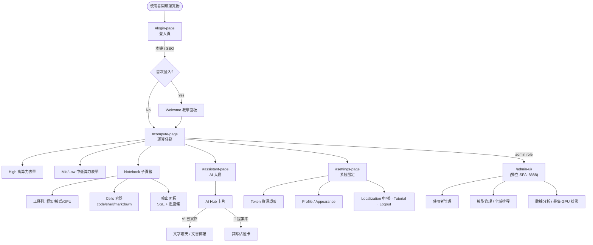

---

## 9. 使用者角色 RBAC

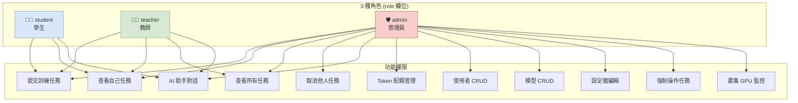

---

## 10. GPU Worker Pull 模式

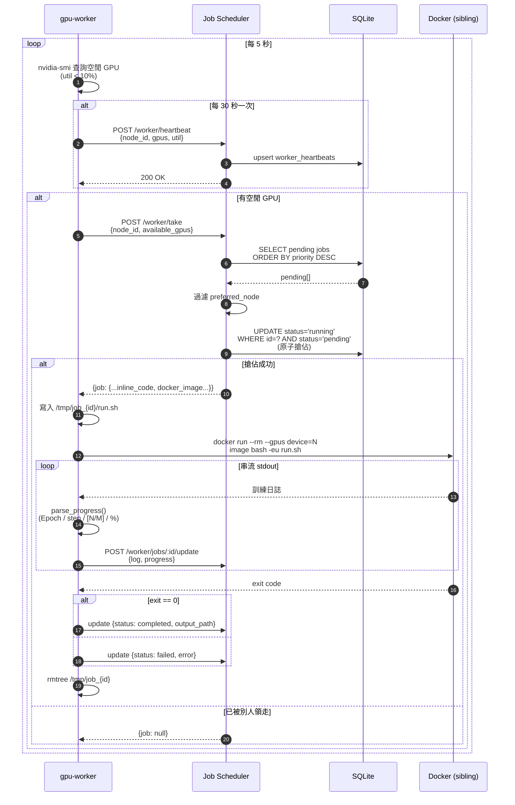

---

## 11. Notebook 提交與執行流程

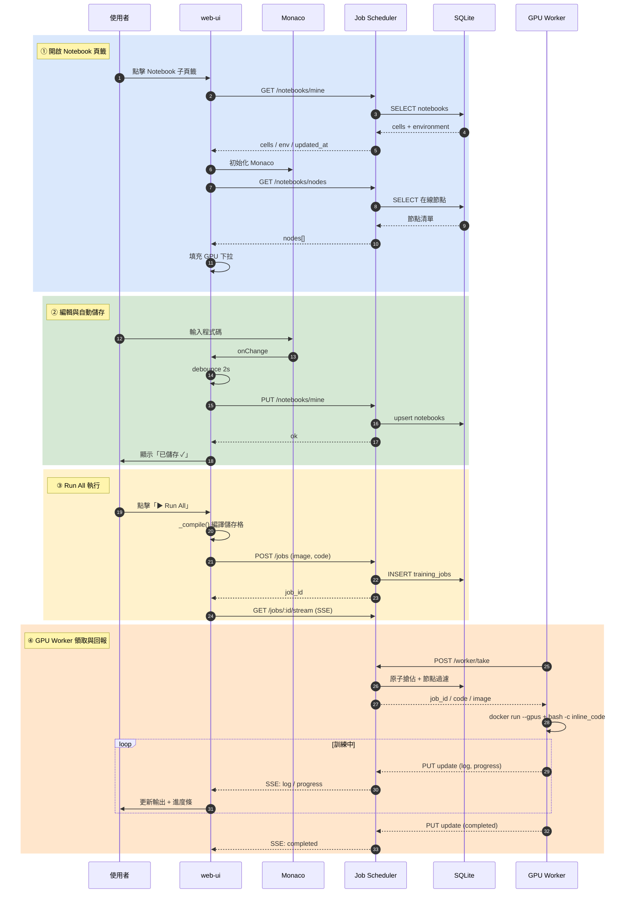

---

## 12. 訓練任務狀態機

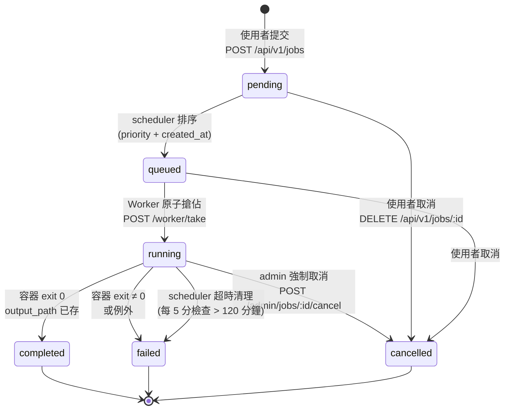

---

## 13. 後端類別關聯圖

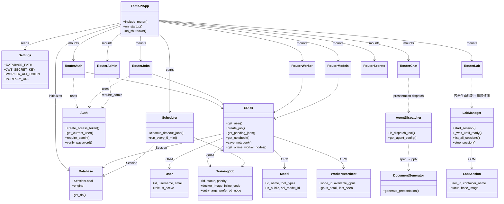

---

## 14. 安全模型摘要

| 威脅 | 防護 |
|---|---|
| 學生互看別人任務 | JWT 認證 + admin-only 端點 |
| 學生互看別人 Lab 工作目錄 | nginx auth_request 驗 user_id 對應 — ⚠️ v2.1 同網段可繞過，**v2.2 加 per-user network**（見 [`08-status-and-roadmap.md`](08-status-and-roadmap.md)） |
| XSS 偷 token | Cookie `HttpOnly` (v2.1)；不過 localStorage 仍可被 XSS 讀取 |
| Secrets 洩漏 | AES-256-GCM 加密儲存、admin 亦不可讀 plaintext、僅在容器啟動時解密注入 |
| GPU 節點被 SSH 入侵 | 採 Pull 架構、無需開對外 port |
| 服務層被駭 → 橫向移動 | 服務層無 GPU 節點私鑰、最多塞惡意任務（被 `--rm` 容器隔離）|
| 暴力破解 admin | rate limit + emergency-only port 8888 |

---

## 渲染建議 | Rendering Tips

- **GitHub**：直接開啟即可自動渲染 Mermaid。
- **VS Code**：安裝 `Markdown Preview Mermaid Support` 擴充套件。
- **Obsidian**：原生支援。
- **匯出 PNG/SVG**：`npx -p @mermaid-js/mermaid-cli mmdc -i 02-architecture.md -o out.png`
- **線上編輯**：複製單一 ```mermaid 區塊至 [Mermaid Live Editor](https://mermaid.live/)。

---

## 下一步

- [`03-deployment.md`](03-deployment.md) — 加 GPU 工作節點 / SSO / 正式上線
- [`05-api-reference.md`](05-api-reference.md) — API 完整參考
- [`07-development.md`](07-development.md) — 模組擴展、新增 router、i18n
