# 系統架構圖表（Mermaid）| Architecture Diagrams (Mermaid)

> 本文件以 Mermaid 語法繪製專案完整架構，可直接在 GitHub / VS Code / Obsidian 等支援 Mermaid 的工具中渲染。

## 📑 目錄 | Table of Contents
1. [檔案結構樹（Project File Tree）](#1-檔案結構樹-project-file-tree)
2. [三層系統架構（Three-Layer Architecture）](#2-三層系統架構-three-layer-architecture)
3. [Docker 容器網路（Container Network）](#3-docker-容器網路-container-network)
4. [資料庫 ER 圖（Database ER）](#4-資料庫-er-圖-database-er)
5. [API 端點地圖（API Endpoint Map）](#5-api-端點地圖-api-endpoint-map)
6. [前端模組與頁面導覽（Frontend Navigation）](#6-前端模組與頁面導覽-frontend-navigation)
7. [使用者角色 RBAC（Role-Based Access Control）](#7-使用者角色-rbac-role-based-access-control)
8. [使用者認證流程（Auth Sequence）](#8-使用者認證流程-auth-sequence)
9. [GPU Worker Pull 模式（Worker Pull Sequence）](#9-gpu-worker-pull-模式-worker-pull-sequence)
10. [Notebook 提交與執行流程（Notebook Execution Sequence）](#10-notebook-提交與執行流程-notebook-execution-sequence)
11. [訓練任務狀態機（Job State Machine）](#11-訓練任務狀態機-job-state-machine)
12. [類別關聯圖（Class Diagram – Backend Modules）](#12-類別關聯圖-class-diagram--backend-modules)

---

## 1. 檔案結構樹（Project File Tree）

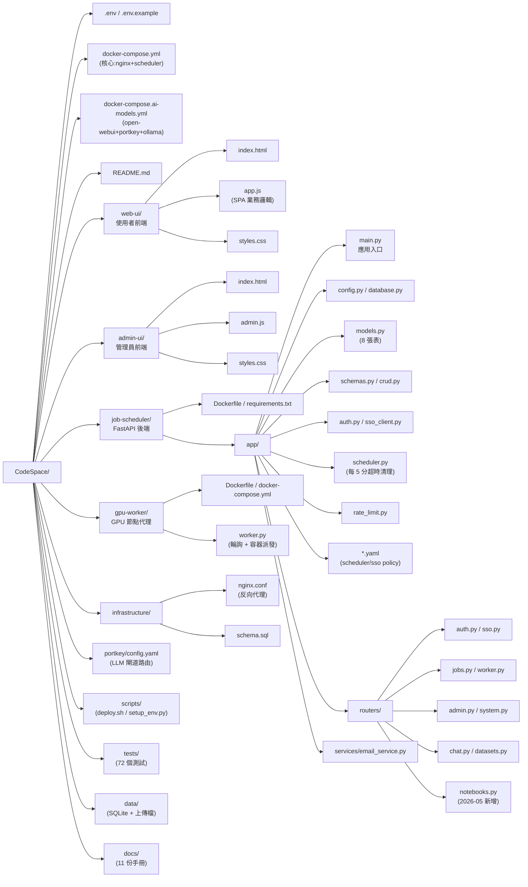

---

## 2. 三層系統架構（Three-Layer Architecture）

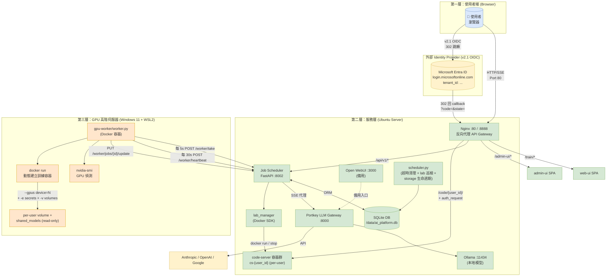

---

## 3. Docker 容器網路（Container Network）

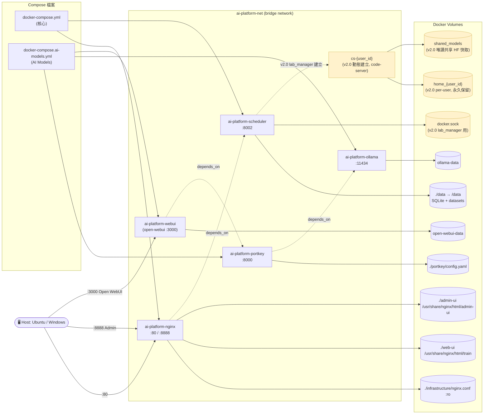

---

## 4. 資料庫 ER 圖（Database ER）

```mermaid
erDiagram
    USERS ||--o| TOKEN_USAGE : has
    USERS ||--o{ TRAINING_JOBS : submits
    USERS ||--o{ CHAT_HISTORY : owns
    USERS ||--o{ MODELS : uploads
    USERS ||--o| LAB_SESSIONS : has
    USERS ||--o{ USER_SECRETS : owns
    USERS ||--o{ QUOTA_GRANTS : receives
    USERS ||--o| USER_STORAGE_STATE : has
    USERS ||--o{ ADMIN_ACTIONS : performs
    USERS ||--o{ USER_SESSION_USAGE : tracks

    USERS {
        string  id PK "UUID"
        string  username UK
        string  email UK
        string  hashed_password "SSO 使用者為隨機值"
        string  role "student/teacher/admin"
        int     is_active
        int     is_test_account
        int     tutorial_dismissed
        string  department
        int     online_status
        datetime last_login_time
        string  last_login_ip
        int     login_count
        int     lifetime_tokens_used
        int     disk_quota_gb "v2.0 Lab 配額"
        string  auth_source "v2.1: local/sso_mock/sso_cas/sso_oidc"
        string  external_id "v2.1: OIDC oid (Microsoft 永久 ID)"
        datetime created_at
        datetime updated_at
    }

    TOKEN_USAGE {
        string  id PK
        string  user_id FK "CASCADE"
        int     tokens_used
        int     tokens_limit
        datetime reset_date
        datetime last_updated
    }

    TRAINING_JOBS {
        string  id PK
        string  user_id FK "SET NULL"
        string  job_name
        string  model_name
        string  status "pending|queued|running|completed|failed|cancelled"
        int     gpu_required
        int     priority "0-5"
        text    config "JSON"
        string  gpu_server
        int     gpu_id
        string  script_path
        string  dataset_path
        string  docker_image "v2.0 Lab 用"
        text    inline_code "v2.0 Lab compile 後的 shell script"
        text    entry_args "v2.0 Lab 自訂入口 JSON 陣列"
        string  preferred_node "v2.0 Lab GPU 親和性"
        float   progress
        text    logs
        text    metrics "JSON"
        text    error_message
        string  output_path
        datetime created_at
        datetime started_at
        datetime completed_at
    }

    MODELS {
        string  id PK
        string  name UK
        string  model_type "api|local"
        text    description
        string  framework
        string  storage_path
        int     size_bytes
        string  uploaded_by FK
        int     is_public
        string  api_provider
        string  api_endpoint
        string  api_model_id
        datetime created_at
    }

    CHAT_HISTORY {
        string  id PK
        string  user_id FK "CASCADE"
        string  session_id
        string  role "user|assistant"
        text    content
        string  tool_type
        int     tokens_used
        datetime created_at
    }

    SYSTEM_CONFIG {
        string  key PK
        string  value
        text    description
        datetime updated_at
    }

    WORKER_HEARTBEATS {
        string  node_id PK
        text    available_gpus "JSON array"
        float   gpu_utilization
        datetime last_seen
        int     is_online
        string  pool_type "v2.0 Lab: batch/interactive"
    }

    LAB_SESSIONS {
        string  user_id PK "FK CASCADE"
        string  session_name PK "v2.0: default; v2.1 預留多 session"
        string  container_id
        string  container_name "cs-{user_id}"
        string  status "stopped/starting/running/stopping"
        string  volume_name "home_{user_id}"
        string  base_image
        datetime last_activity
        datetime started_at
        float   cpu_quota
        int     mem_quota_mb
    }

    USER_SECRETS {
        string  id PK
        string  user_id FK "CASCADE"
        string  name "env var name (e.g. HF_TOKEN)"
        blob    value_enc "AES-256-GCM 加密"
        datetime created_at
        datetime updated_at
    }

    QUOTA_GRANTS {
        string  id PK
        string  user_id FK "CASCADE"
        int     extra_quota_gb
        string  granted_by FK "admin user id"
        text    reason "≥5 字審計用"
        datetime granted_at
        datetime expires_at
        datetime revoked_at
    }

    USER_STORAGE_STATE {
        string  user_id PK "FK CASCADE"
        string  state "active/frozen/archived/pending_delete"
        datetime state_since
        float   current_size_gb
        string  archive_path "歸檔後 HDD 路徑"
        text    notes
    }

    ADMIN_ACTIONS {
        string  id PK
        string  admin_id FK
        string  target_user FK "nullable"
        string  action "grant_quota/freeze/archive/.../delete"
        text    payload "JSON"
        datetime timestamp
        string  ip_address
    }

    USER_SESSION_USAGE {
        string  user_id PK "FK CASCADE"
        date    date PK
        int     total_seconds
        int     session_count
    }
```

> **Phase E 移除**：v1 NOTEBOOKS 表已於 2026-05 Phase E 隨 v2.0 Lab 上線同時 DROP（training_jobs 的 4 個 Notebook 欄位保留供 Lab Run on GPU 使用）。

---

## 5. API 端點地圖（API Endpoint Map）

```mermaid
flowchart LR
    API(("/api/v1"))

    API --> AuthGrp["auth/"]
    AuthGrp --> A1["POST /login"]
    AuthGrp --> A2["POST /register"]
    AuthGrp --> A3["GET /me"]
    AuthGrp --> A4["PUT /me<br/>(SSO 改密碼拒絕)"]
    AuthGrp --> A5["GET /usage"]
    AuthGrp --> A6["POST /logout"]
    AuthGrp --> A7["POST /forgot-password"]

    API --> SSOGrp["sso/<br/>(Mock / CAS / OIDC)"]
    SSOGrp --> SS1["GET /login<br/>主 provider 跳轉"]
    SSOGrp --> SS2["GET /callback<br/>CAS / Mock"]
    SSOGrp --> SS3["GET /mock-login (HTML)"]
    SSOGrp --> SS4["POST /mock-submit"]
    SSOGrp --> SS5["GET /oidc/login<br/>v2.1 跳 Microsoft"]
    SSOGrp --> SS6["GET /oidc/callback<br/>v2.1 code→id_token"]
    SSOGrp --> SS7["GET /providers<br/>v2.1 前端用"]
    SSOGrp --> SS8["GET /password-change-info<br/>v2.1 密碼變更分流"]

    API --> JobsGrp["jobs/"]
    JobsGrp --> J1["POST / (含 inline_code)"]
    JobsGrp --> J2["GET /"]
    JobsGrp --> J3["GET /:id"]
    JobsGrp --> J4["DELETE /:id"]
    JobsGrp --> J5["GET /:id/stream<br/>(SSE)"]

    API --> ChatGrp["chat/"]
    ChatGrp --> CH1["POST /completions<br/>(SSE)"]
    ChatGrp --> CH2["GET /history"]

    API --> DSGrp["datasets/"]
    DSGrp --> D1["POST /upload"]
    DSGrp --> D2["GET /list"]

    API --> LabGrp["lab/<br/>v2.0 code-server"]
    LabGrp --> L1["POST /start<br/>(限速 5/min)"]
    LabGrp --> L2["POST /stop"]
    LabGrp --> L3["GET /status"]
    LabGrp --> L4["POST /heartbeat<br/>(extension 每 5 分)"]
    LabGrp --> L5["GET /nodes<br/>(依 pool_type 篩選)"]
    LabGrp --> L6["GET /_authz<br/>(nginx auth_request)"]

    API --> SecGrp["secrets/<br/>v2.0 AES-256-GCM"]
    SecGrp --> SC1["GET /<br/>(masked, 永不回 plaintext)"]
    SecGrp --> SC2["PUT /:name"]
    SecGrp --> SC3["DELETE /:name"]

    API --> WkGrp["worker/<br/>Bearer Token"]
    WkGrp --> W1["POST /take<br/>(注入 secrets + volumes)"]
    WkGrp --> W2["POST /jobs/:id/update"]
    WkGrp --> W3["POST /heartbeat"]

    API --> SysGrp["system/<br/>admin only"]
    SysGrp --> S1["GET /files"]
    SysGrp --> S2["GET /files/:name"]
    SysGrp --> S3["PUT /files/:name"]

    API --> AdmGrp["admin/<br/>admin only"]
    AdmGrp --> AD1["GET /users"]
    AdmGrp --> AD2["PUT /users/:id"]
    AdmGrp --> AD3["POST /users/:id/delete"]
    AdmGrp --> AD4["POST /users/:id/reset"]
    AdmGrp --> AD5["POST /users/provision"]
    AdmGrp --> AD6["PUT /users/batch/tokens"]
    AdmGrp --> AD7["POST /verify"]
    AdmGrp --> AD8["GET /jobs"]
    AdmGrp --> AD9["POST /jobs/:id/cancel"]
    AdmGrp --> AD10["PUT /jobs/:id/priority"]
    AdmGrp --> AD11["models GET/POST/PUT/DELETE"]
    AdmGrp --> AD12["GET /cluster/stats"]
    AdmGrp --> AD13["GET /analytics"]

    AdmGrp --> AD20["v2.0 Quota:<br/>POST /quota/grant<br/>DELETE /quota/grant/:id<br/>GET /quota/:user_id"]
    AdmGrp --> AD21["v2.0 Storage:<br/>POST /storage/freeze<br/>POST /storage/archive<br/>POST /storage/restore<br/>POST /storage/permanent-delete<br/>GET /storage/states"]
    AdmGrp --> AD22["v2.0 Lab:<br/>GET /lab/sessions<br/>POST /lab/sessions/:id/force-stop"]
    AdmGrp --> AD23["v2.0 Secrets 監控:<br/>GET /secrets/:user_id/names<br/>DELETE /secrets/:user_id/:name"]
    AdmGrp --> AD24["v2.0 Audit:<br/>GET /audit"]

    classDef v2 fill:#fff2cc,stroke:#d6b656
    classDef v21 fill:#ffe6e6,stroke:#cc6666
    class LabGrp,L1,L2,L3,L4,L5,L6,SecGrp,SC1,SC2,SC3,AD20,AD21,AD22,AD23,AD24 v2
    class SS5,SS6,SS7,SS8 v21
```

> **Phase E 移除**：v1 `notebooks/` 端點群（`GET/PUT /mine`、`GET /nodes`）已於 2026-05 隨 v2.0 Lab 上線同時下線。

---

## 6. 前端模組與頁面導覽（Frontend Navigation）

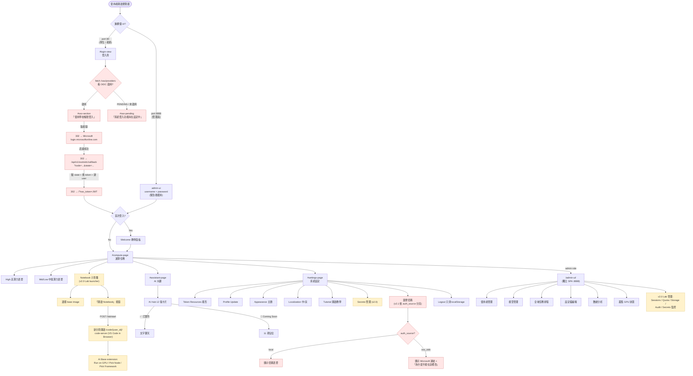

---

## 7. 使用者角色 RBAC（Role-Based Access Control + Auth Source）

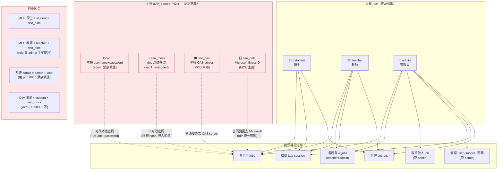

---

## 8. 使用者認證流程（Auth Sequence）

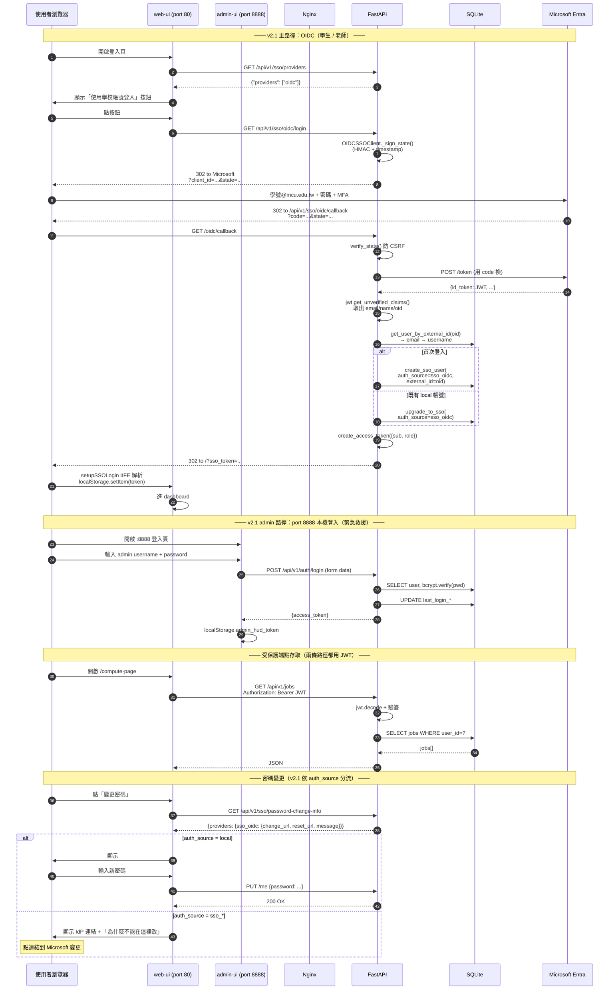

---

## 9. GPU Worker Pull 模式（Worker Pull Sequence）

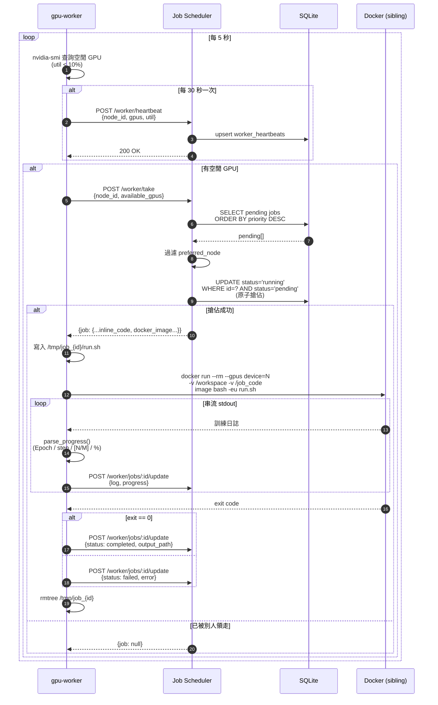

---

## 10. v2.0 Lab 啟動與 Run on GPU 流程（Lab Execution Sequence）

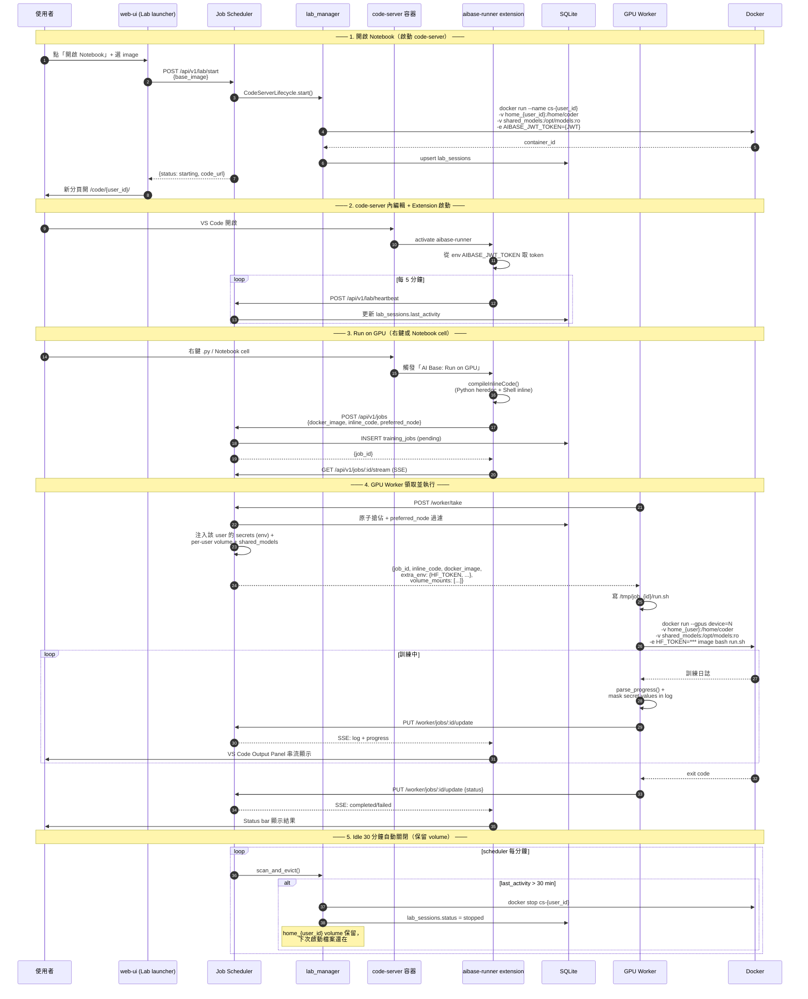

> **Phase E 移除**：v1 `notebooks/mine` 自動儲存流程已隨 Lab launcher 上線同時下線。

---

## 11. 訓練任務狀態機（Job State Machine）

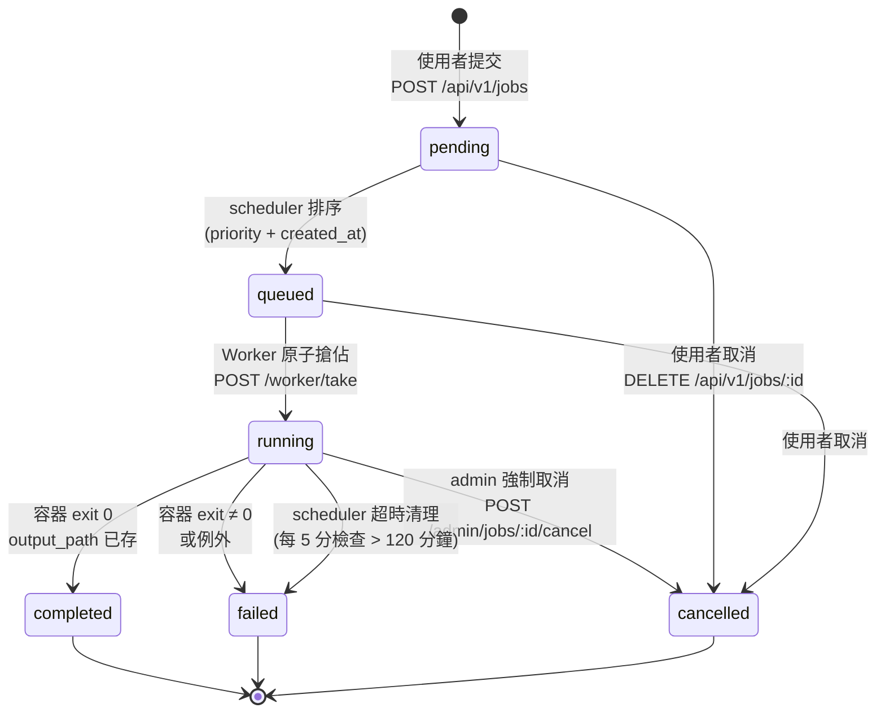

---

## 12. 類別關聯圖（Class Diagram – Backend Modules）

```mermaid
classDiagram
    class FastAPIApp {
        +include_router()
        +on_startup()
        +on_shutdown()
    }

    class Settings {
        +DATABASE_PATH
        +JWT_SECRET_KEY
        +WORKER_API_TOKEN
        +SECRETS_MASTER_KEY (v2.0)
        +PORTKEY_URL
    }

    class OIDCConfig {
        +OIDC_ENABLED (v2.1 flag)
        +SSO_POLICY (yaml)
    }

    class Database {
        +SessionLocal
        +engine
        +Base
        +get_db()
    }

    class CRUD {
        +get_user()
        +create_user()
        +create_sso_user(auth_source, external_id)
        +update_user (v2.1 SSO 拒絕)
        +get_user_by_external_id (v2.1)
        +upgrade_to_sso (v2.1)
        +create_job()
        +get_pending_jobs()
        +upsert_worker_heartbeat()
        +get_online_worker_nodes()
    }

    class Auth {
        +create_access_token()
        +get_current_user()
        +require_admin()
        +verify_password()
    }

    class Scheduler {
        +cleanup_timeout_jobs()
        +scan_lab_sessions (v2.0)
        +storage_lifecycle_loop (v2.0)
    }

    class BaseSSOClient {
        <<abstract>>
        +get_login_url()
        +validate_ticket(ticket)
    }
    class MockSSOClient {
        +validate_ticket → auth_source=sso_mock
    }
    class CASSSOClient {
        +validate_ticket → auth_source=sso_cas
    }
    class OIDCSSOClient {
        +tenant_id, client_id, redirect_uri
        +get_login_url() with state
        +validate_ticket(code) → id_token claims
        +_sign_state() HMAC
        +verify_state() 防 CSRF
    }
    BaseSSOClient <|-- MockSSOClient
    BaseSSOClient <|-- CASSSOClient
    BaseSSOClient <|-- OIDCSSOClient

    class LabManager {
        <<v2.0>>
        +start_codeserver()
        +stop_codeserver()
        +scan_and_evict()
    }
    class SecretsService {
        <<v2.0>>
        +encrypt() AES-256-GCM
        +decrypt()
        +inject_to_env(job_id)
    }
    class QuotaService {
        <<v2.0>>
        +grant() with audit
        +revoke()
        +get_effective_quota()
    }
    class StorageLifecycle {
        <<v2.0>>
        +freeze() / archive() / restore()
        +permanent_delete() with admin pwd
    }

    class RouterAuth
    class RouterJobs
    class RouterWorker
    class RouterChat
    class RouterAdmin
    class RouterDatasets
    class RouterSystem
    class RouterSSO {
        +oidc/login (v2.1)
        +oidc/callback (v2.1)
        +providers (v2.1)
        +password-change-info (v2.1)
    }
    class RouterLab {
        <<v2.0>>
        +start/stop/status/heartbeat
        +nodes/_authz
    }
    class RouterSecrets {
        <<v2.0>>
        +GET / PUT / DELETE
    }

    class User {
        +id, username, email
        +role, is_active
        +disk_quota_gb (v2.0)
        +auth_source (v2.1)
        +external_id (v2.1)
    }
    class TrainingJob {
        +id, status, priority
        +docker_image, inline_code
        +entry_args, preferred_node
    }
    class LabSession {
        <<v2.0>>
        +user_id, container_id
        +status, last_activity
    }
    class UserSecret {
        <<v2.0>>
        +user_id, name
        +value_enc (AES)
    }
    class WorkerHeartbeat {
        +node_id, available_gpus
        +pool_type (v2.0)
    }

    FastAPIApp --> Settings : reads
    FastAPIApp --> OIDCConfig : derives flag
    FastAPIApp --> Database : initializes
    FastAPIApp --> RouterAuth : mounts
    FastAPIApp --> RouterJobs : mounts
    FastAPIApp --> RouterWorker : mounts
    FastAPIApp --> RouterChat : mounts
    FastAPIApp --> RouterAdmin : mounts
    FastAPIApp --> RouterDatasets : mounts
    FastAPIApp --> RouterSystem : mounts
    FastAPIApp --> RouterSSO : mounts
    FastAPIApp --> RouterLab : mounts (v2.0)
    FastAPIApp --> RouterSecrets : mounts (v2.0)
    FastAPIApp --> Scheduler : starts

    RouterAuth --> CRUD
    RouterJobs --> CRUD
    RouterWorker --> CRUD
    RouterWorker --> SecretsService : inject env (v2.0)
    RouterChat --> CRUD
    RouterAdmin --> CRUD
    RouterAdmin --> QuotaService
    RouterAdmin --> StorageLifecycle
    RouterAdmin --> LabManager
    RouterSSO --> BaseSSOClient : uses
    RouterSSO --> CRUD : create_sso_user
    RouterLab --> LabManager
    RouterSecrets --> SecretsService

    RouterAuth ..> Auth : uses
    RouterJobs ..> Auth : uses
    RouterAdmin ..> Auth : require_admin
    RouterLab ..> Auth : uses
    RouterSecrets ..> Auth : uses

    CRUD --> Database : Session
    CRUD --> User : ORM
    CRUD --> TrainingJob : ORM
    CRUD --> LabSession : ORM (v2.0)
    CRUD --> UserSecret : ORM (v2.0)
    CRUD --> WorkerHeartbeat : ORM

    Scheduler --> Database : Session
    Scheduler --> TrainingJob : timeout
    Scheduler --> LabManager : scan_and_evict (v2.0)
    Scheduler --> StorageLifecycle : daily 03:00 (v2.0)
```

---

## 渲染建議 | Rendering Tips

- **GitHub**：直接開啟 `.md` 即可自動渲染 Mermaid。
- **VS Code**：安裝 `Markdown Preview Mermaid Support` 擴充套件。
- **Obsidian**：原生支援。
- **匯出 PNG/SVG**：
  ```bash
  npx -p @mermaid-js/mermaid-cli mmdc -i ARCHITECTURE-MERMAID.md -o out.png
  ```
- **線上編輯**：複製單一程式碼區塊至 [Mermaid Live Editor](https://mermaid.live/)。
