# 系統架構圖表（Mermaid）| Architecture Diagrams (Mermaid)

> 本文件以 Mermaid 語法繪製專案完整架構，可直接在 GitHub / VS Code / Obsidian 等支援 Mermaid 的工具中渲染。
> 2026-06 二次重新設計：#2 三層架構（拆除巢狀 subgraph、精簡連線標籤，徹底消除連線覆蓋方塊）、#8 / #10 循序圖（階段標題改置於左側 margin `Note left of`，並縮短自訊息與箭頭標籤避免壓字）。
>
> **v2.4 對齊提醒**：本檔為「圖表集」；**最新且最完整**的架構與「各模組分布與交互」請見
> [`../02-architecture.md`](../02-architecture.md)（§1 三層、**§1.5 服務層模組分布與交互 Component Map**、§6 容器網路、§7 API 地圖）。
> 重點差異：Portkey OSS 監聽 **:8787**（header 路由、Ollama 經 `x-portkey-custom-host`）、新增 `/api/v1/models` 動態模型清單、`agent_dispatcher`/`document_generator` 文書簡報、Lab 就緒偵測、GPU per-card telemetry。

## 📑 目錄 | Table of Contents
1. [檔案結構樹（Project File Tree）](#1-檔案結構樹-project-file-tree)
2. [三層系統架構（Three-Layer Architecture）](#2-三層系統架構-three-layer-architecture)
3. [Docker 容器網路（Container Network）](#3-docker-容器網路-container-network)
4. [資料庫 ER 圖（Database ER）](#4-資料庫-er-圖-database-er)
5. [API 端點地圖（API Endpoint Map）](#5-api-端點地圖-api-endpoint-map)
6. [前端模組與頁面導覽（Frontend Navigation）](#6-前端模組與頁面導覽-frontend-navigation)
7. [使用者角色 RBAC（Role-Based Access Control）](#7-使用者角色-rbac-role-based-access-control)
8. [使用者認證流程（Auth Sequence）](#8-使用者認證流程-auth-sequence)
9. [GPU Worker Pull 模式（Worker Pull Sequence）](#9-gpu-worker-pull-模式-worker-pull-sequence)
10. [Notebook 提交與執行流程（Notebook Execution Sequence）](#10-notebook-提交與執行流程-notebook-execution-sequence)
11. [訓練任務狀態機（Job State Machine）](#11-訓練任務狀態機-job-state-machine)
12. [類別關聯圖（Class Diagram – Backend Modules）](#12-類別關聯圖-class-diagram--backend-modules)

---

## 1. 檔案結構樹（Project File Tree）

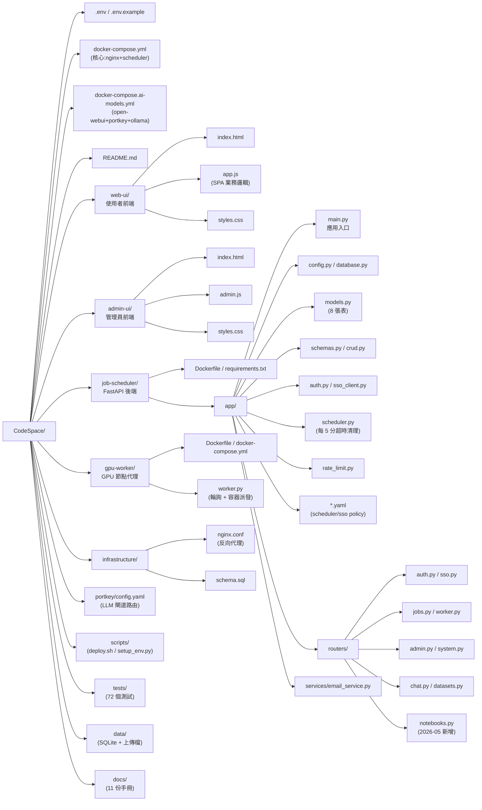

---

## 2. 三層系統架構（Three-Layer Architecture）

> 二次重新設計重點：拆除巢狀 subgraph（前端 SPA / LLM 推理不再各自包一層框），
> 巢狀框邊界正是先前連線橫越的主因；同時把多行長標籤精簡成單行短字，
> 消除浮動標籤方塊壓住節點。三層仍以 L1/L2/L3 subgraph 區隔，群組資訊改寫進節點名稱。

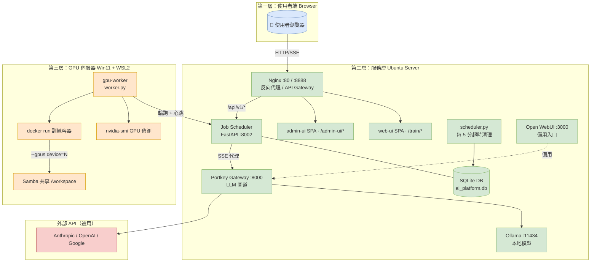

---

## 3. Docker 容器網路（Container Network）

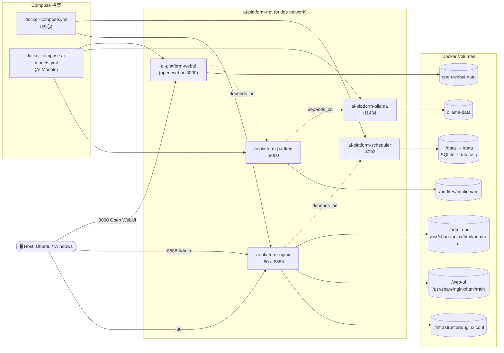

---

## 4. 資料庫 ER 圖（Database ER）

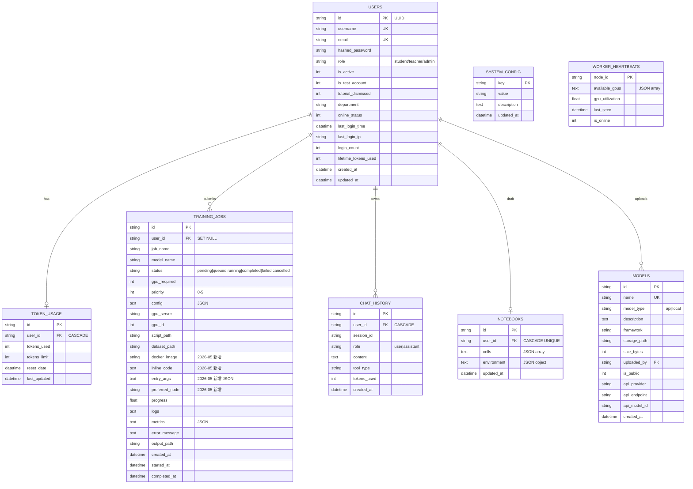

---

## 5. API 端點地圖（API Endpoint Map）

```mermaid
flowchart LR
    API(("/api/v1"))

    API --> AuthGrp["auth/"]
    AuthGrp --> A1["POST /login"]
    AuthGrp --> A2["POST /register"]
    AuthGrp --> A3["GET /me"]
    AuthGrp --> A4["PUT /me"]
    AuthGrp --> A5["GET /usage"]
    AuthGrp --> A6["POST /logout"]
    AuthGrp --> A7["POST /forgot-password"]
    AuthGrp --> A8["POST /sso/login"]

    API --> JobsGrp["jobs/"]
    JobsGrp --> J1["POST /"]
    JobsGrp --> J2["GET /"]
    JobsGrp --> J3["GET /:id"]
    JobsGrp --> J4["DELETE /:id"]
    JobsGrp --> J5["GET /:id/stream<br/>(SSE)"]

    API --> ChatGrp["chat/"]
    ChatGrp --> CH1["POST /completions<br/>(SSE)"]
    ChatGrp --> CH2["GET /history"]

    API --> DSGrp["datasets/"]
    DSGrp --> D1["POST /upload"]
    DSGrp --> D2["GET /list"]

    API --> NBGrp["notebooks/<br/>(2026-05)"]
    NBGrp --> NB1["GET /mine"]
    NBGrp --> NB2["PUT /mine"]
    NBGrp --> NB3["GET /nodes"]

    API --> WkGrp["worker/<br/>Bearer Token"]
    WkGrp --> W1["POST /take"]
    WkGrp --> W2["POST /jobs/:id/update"]
    WkGrp --> W3["POST /heartbeat"]

    API --> SysGrp["system/<br/>admin only"]
    SysGrp --> S1["GET /files"]
    SysGrp --> S2["GET /files/:name"]
    SysGrp --> S3["PUT /files/:name"]

    API --> AdmGrp["admin/<br/>admin only"]
    AdmGrp --> AD1["GET /users"]
    AdmGrp --> AD2["PUT /users/:id"]
    AdmGrp --> AD3["POST /users/:id/delete"]
    AdmGrp --> AD4["POST /users/:id/reset"]
    AdmGrp --> AD5["POST /users/provision"]
    AdmGrp --> AD6["PUT /users/batch/tokens"]
    AdmGrp --> AD7["POST /verify"]
    AdmGrp --> AD8["GET /jobs"]
    AdmGrp --> AD9["POST /jobs/:id/cancel"]
    AdmGrp --> AD10["PUT /jobs/:id/priority"]
    AdmGrp --> AD11["GET /models / POST / PUT / DELETE"]
    AdmGrp --> AD12["GET /cluster/stats"]
    AdmGrp --> AD13["GET /analytics"]

    classDef new fill:#fff2cc,stroke:#d6b656
    class NBGrp,NB1,NB2,NB3 new
```

---

## 6. 前端模組與頁面導覽（Frontend Navigation）

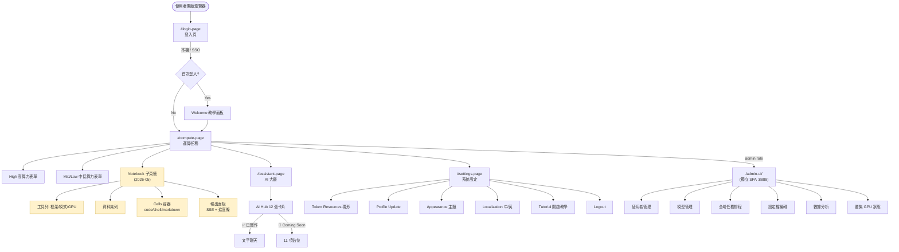

---

## 7. 使用者角色 RBAC（Role-Based Access Control）

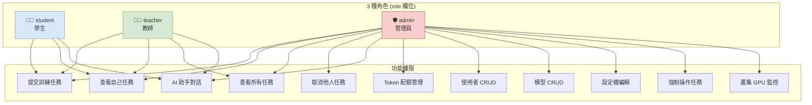

---

## 8. 使用者認證流程（Auth Sequence）

> 二次重新設計重點：階段標題從橫跨所有 lifeline 的 `Note over U,SSO`（整列大方塊）
> 改為靠左 margin 的 `Note left of U`（小標籤、不壓 lifeline），色帶仍保留分段；
> 並合併／縮短自訊息標籤，避免向右溢出蓋住相鄰 lifeline。

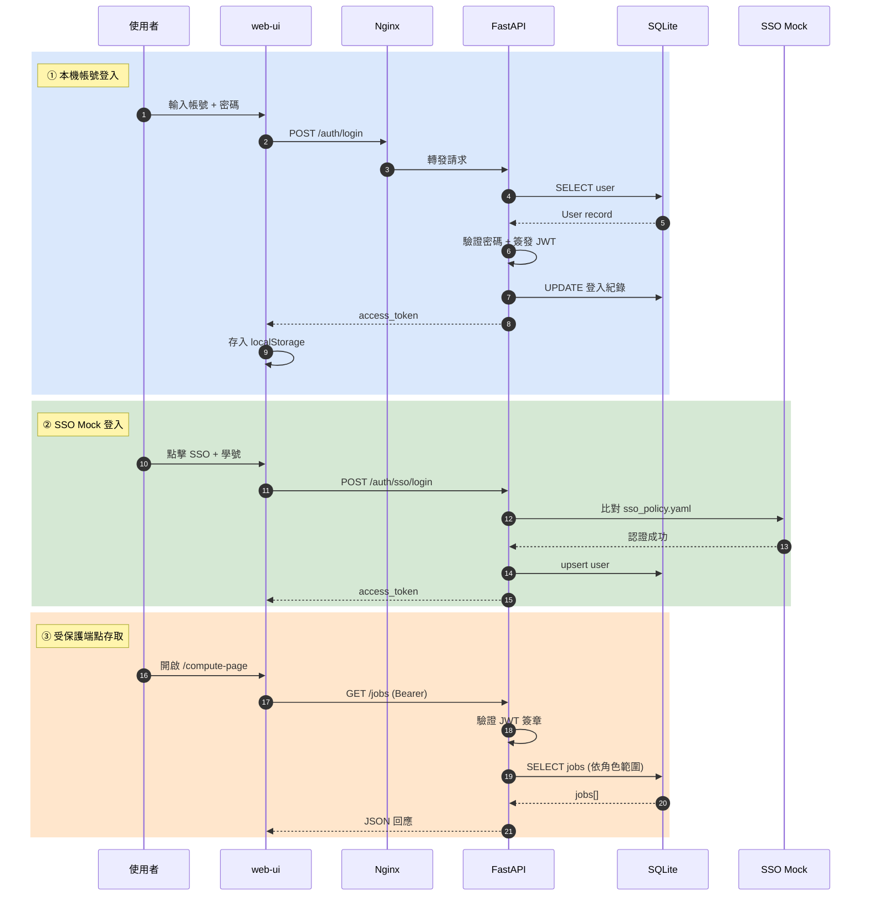

---

## 9. GPU Worker Pull 模式（Worker Pull Sequence）

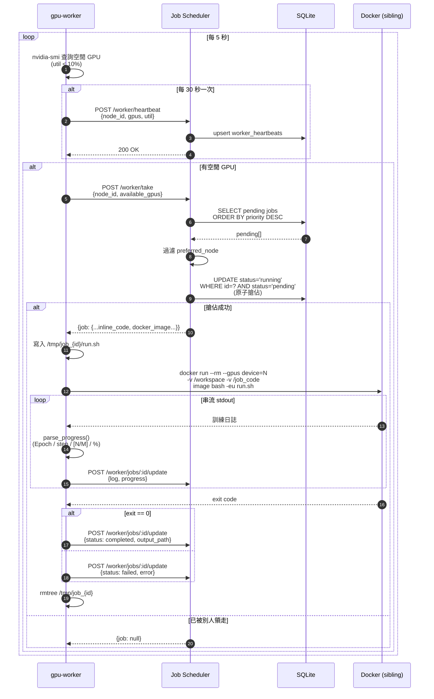

---

## 10. Notebook 提交與執行流程（Notebook Execution Sequence）

> 二次重新設計重點：四階段標題從橫跨全 lifeline 的 `Note over U,WK`（整列大方塊）
> 改為靠左 margin 的 `Note left of U`，色帶仍保留分段；訊息標籤縮短、拆除多行 `<br/>`，
> 避免標籤方塊向右溢出蓋住中間 lifeline。

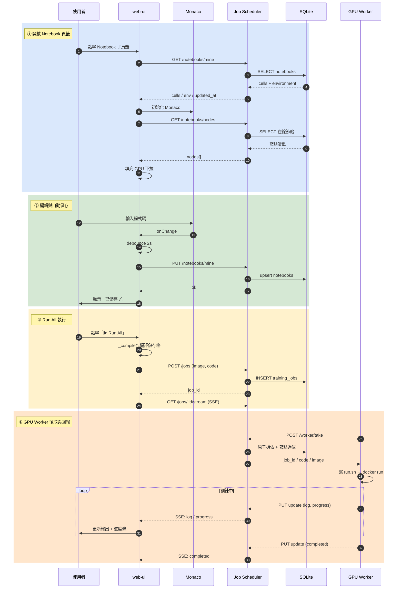

---

## 11. 訓練任務狀態機（Job State Machine）

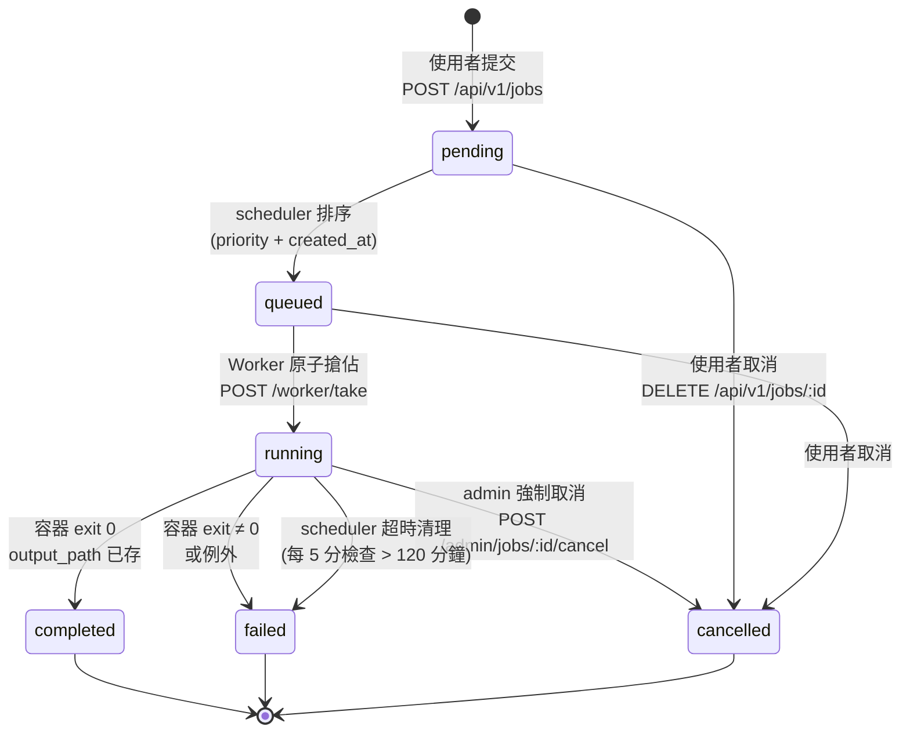

---

## 12. 類別關聯圖（Class Diagram – Backend Modules）

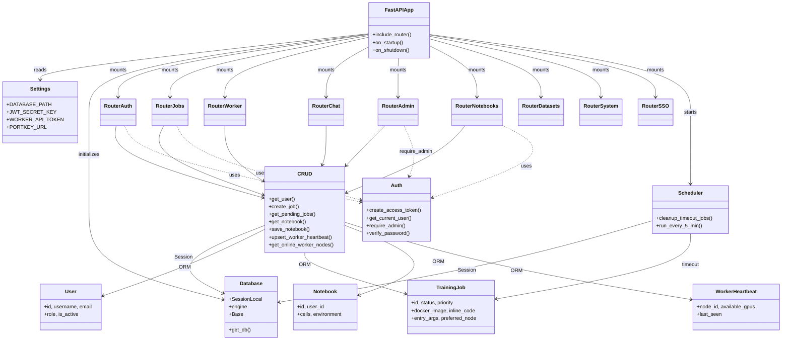

---

## 渲染建議 | Rendering Tips

- **GitHub**：直接開啟 `.md` 即可自動渲染 Mermaid。
- **VS Code**：安裝 `Markdown Preview Mermaid Support` 擴充套件。
- **Obsidian**：原生支援。
- **匯出 PNG/SVG**：
  ```bash
  npx -p @mermaid-js/mermaid-cli mmdc -i ARCHITECTURE-MERMAID.md -o out.png
  ```
- **線上編輯**：複製單一程式碼區塊至 [Mermaid Live Editor](https://mermaid.live/)。
